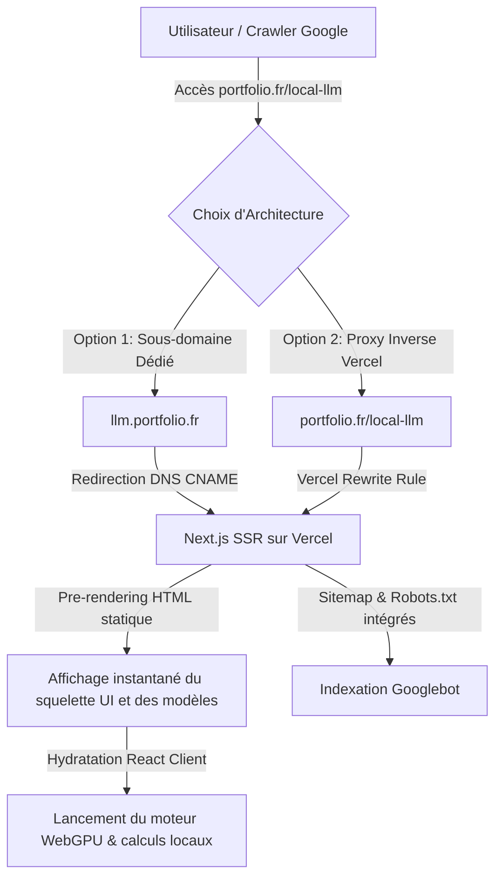

# Architecture de Déploiement Next.js SSR & Référencement Google (SEO)

Ce projet est construit avec **Next.js (App Router)** et utilise le rendu côté serveur (**SSR / Static Pre-rendering**) pour offrir un temps de chargement ultra-rapide (First Contentful Paint optimal) et une indexation parfaite sur Google.

---

## 🛠️ Schéma d'Architecture Général



---

## 🚀 Rendu Côté Serveur (SSR) & Performance SEO
Contrairement aux applications classiques de type SPA (Client-Side Rendering) qui servent un fichier HTML vide (`<div id="root"></div>`), cette version Next.js génère l'ensemble du squelette de l'application sur le serveur à la compilation :
*   Le menu latéral, le titre principal, les explications et surtout la **liste des modèles optimisés** sont encodés en HTML brut.
*   Les moteurs de recherche comme Googlebot lisent le contenu textuel immédiatement sans avoir besoin d'attendre l'exécution de JavaScript, ce qui garantit un excellent positionnement SEO.
*   L'isolation WebGPU (qui requiert `navigator.gpu`) est sécurisée dans un hook client (`useEffect`), évitant toute erreur de compilation côté serveur.

---

## 📋 Option 1 : Sous-domaine Dédié (`llm.khanonyan.fr`)
*Méthode recommandée : elle permet d'isoler les règles strictes de sécurité (COOP/COEP) nécessaires à WebAssembly du reste de votre site principal.*

### 1. Configuration DNS
Chez votre hébergeur de nom de domaine, ajoutez cet enregistrement :
*   **Type** : `CNAME`
*   **Hôte** : `llm` (ou `local-llm`)
*   **Valeur** : `cname.vercel-dns.com.`

### 2. Configuration Vercel
1.  Associez le domaine `llm.khanonyan.fr` dans les paramètres de votre projet sur le tableau de bord Vercel.
2.  Configurez une redirection permanente (301) depuis votre portfolio principal si nécessaire :
    ```json
    {
      "redirects": [
        { "source": "/local-llm", "destination": "https://llm.khanonyan.fr", "permanent": true }
      ]
    }
    ```

---

## 📂 Option 2 : Sous-dossier de Domaine Principal (`khanonyan.fr/local-llm`)
*Recommandé pour consolider l'autorité de domaine et partager le référencement global de votre site.*

### 1. Configuration Vercel Rewrites
Si votre portfolio principal est également hébergé sur Vercel, déclarez ces règles dans son fichier `vercel.json` :
```json
{
  "rewrites": [
    {
      "source": "/local-llm",
      "destination": "https://votre-projet-llm-ssr.vercel.app/"
    },
    {
      "source": "/local-llm/:path*",
      "destination": "https://votre-projet-llm-ssr.vercel.app/:path*"
    }
  ]
}
```

### 2. Métadonnées Canoniques
Dans le fichier `src/app/layout.tsx`, ajustez l'adresse canonique pour cibler la route du sous-dossier :
```typescript
alternates: {
  canonical: "https://khanonyan.fr/local-llm",
}
```

---

## 🔒 Configuration des Headers dans `next.config.ts`
Pour exécuter des calculs WebGPU et manipuler la mémoire partagée (`SharedArrayBuffer` de WebAssembly), Next.js est configuré dans `next.config.ts` pour renvoyer automatiquement les en-têtes d'isolation sur l'ensemble des routes :
```typescript
{
  key: "Cross-Origin-Opener-Policy",
  value: "same-origin"
},
{
  key: "Cross-Origin-Embedder-Policy",
  value: "require-corp"
}
```

---

## 🔍 Indexation et Soumission Google
1.  **Sitemap & Robots** : Les fichiers `public/robots.txt` et `public/sitemap.xml` sont automatiquement servis à la racine de votre domaine.
2.  **Google Search Console** :
    *   Déclarez votre propriété (ex: `https://llm.khanonyan.fr`).
    *   Soumettez le sitemap : `/sitemap.xml`.
    *   Utilisez l'inspecteur d'URL sur `/` pour valider le code HTML rendu côté serveur et demander une indexation prioritaire.
