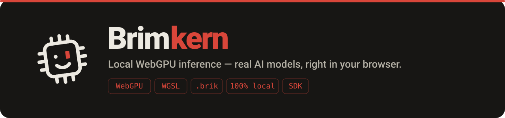
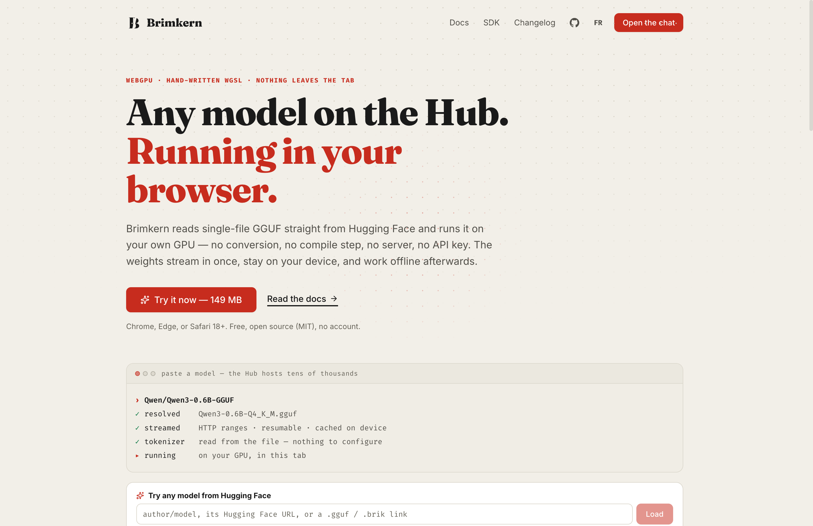
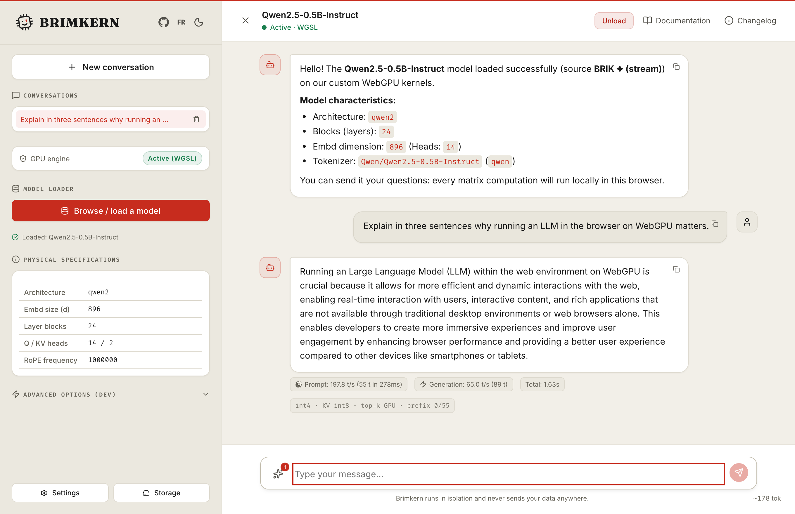
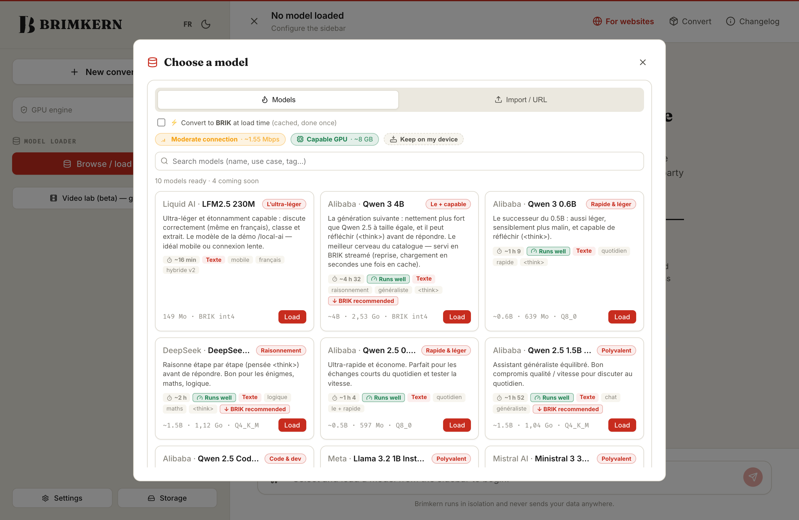
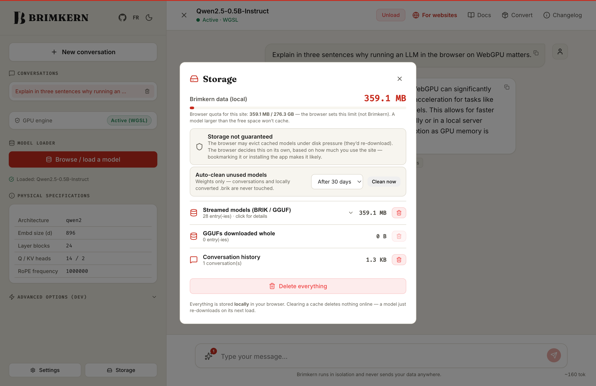
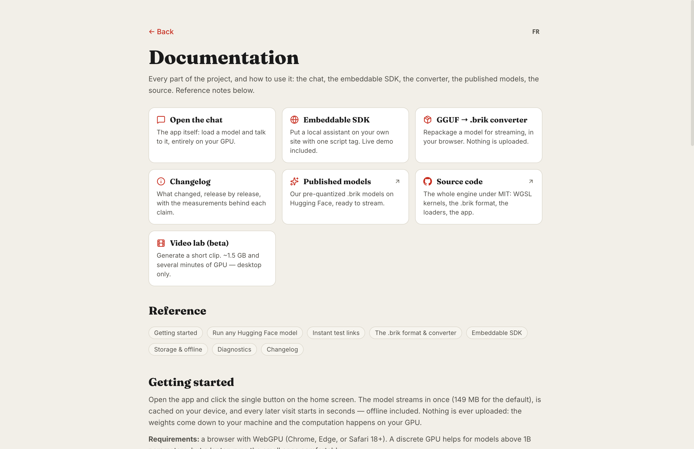

<div align="center">



### Paste a Hugging Face model. Watch it run on **your own GPU**, in a tab.

No conversion. No compile step. No server, no account, no API key.
The weights stream in once, stay on your device, and keep working offline.

`WebGPU` · `hand-written WGSL` · `single-file GGUF` · `.brik streaming` · `100% local` · `embeddable SDK`

**[brimkern.com](https://brimkern.com)** · [open the chat](https://brimkern.com/chat) · [docs](https://brimkern.com/docs)



</div>

---

## The one-sentence version

Every "AI in your browser" either wraps a remote API, or asks you to **pre-compile** the weights into
its own artifact before it will touch them. Brimkern reads the format the Hub already hosts —
**single-file GGUF** — and executes it with WGSL compute shaders we wrote by hand.

That's the whole bet: the Hub holds tens of thousands of single-file GGUFs, and here every one of
them is one paste away.

```
https://brimkern.com/chat?model=Qwen/Qwen3-0.6B-GGUF
https://brimkern.com/chat?model=unsloth/gemma-3-270m-it-GGUF
https://brimkern.com/chat?gguf=https://example.com/your-own.gguf
```

The best quantization is picked for you, the tokenizer is read out of the file, and the architecture
is inferred — there is nothing to configure. Sharded GGUFs and vision projectors are refused with an
explicit message rather than half-loaded.

---

## What you get



Every reply carries its own measurements (above: **460 tok/s prefill, 47.5 tok/s decode** on a
Qwen 2.5 0.5B int4, Apple-silicon laptop). Nothing is estimated in this README — every number below
comes from a run we can reproduce.

| Modality | What you get | How |
| --- | --- | --- |
| 💬 **Chat** | Multi-turn, reasoning models (`<think>`), English & French | Streamed decode on a resident GPU KV-cache |
| 👁️ **Vision** | Ask questions about an image you attach | Qwen2-VL (ViT + projector), desktop |
| 🎨 **Image** | Text-to-image, in-browser | SD-Turbo / SDXS + TAESD, WebGPU diffusion |
| 🎬 **Video** *(beta)* | Short animated clips from a prompt | AnimateDiff-Lightning on the diffusion stack |
| 🧩 **SDK** | On-device AI on *your* site, one `<script>` | See “Embed it” below |

One WGSL kernel library drives all four.

---

## The engine

No `onnxruntime`, no `transformers.js` inference. The forward pass is **hand-written WGSL**:

- Fused quantized matmuls (`matmul_t_q4/q8/q3`), resident KV-cache, single-submit decode.
- A dedicated **decode GEMV** — one 64-thread workgroup per output row, threads splitting the
  quantization groups, shared-memory reduction.
- Per-architecture kernels: RoPE variants, QK-norm, SwiGLU/GEGLU, GroupNorm, causal & temporal
  attention, short-conv (hybrid models), direct conv2d for diffusion.

Two rules make that safe to ship, and they're worth stealing:

1. **Every kernel self-validates at load** against a CPU reference, and falls back to the slower,
   simpler path if a GPU miscompiles. A wrong answer is a bug; a slow answer is a Tuesday.
   There is also a second, independent CPU reference for the *whole* forward pass, written from the
   architecture rather than from our pipeline, which compares logits and the hidden state after every
   layer. It is what caught the last real correctness bug: an optimization that prefetched a layer in
   one HTTP range was filling the weight cache directly and skipping the row fix Llama's Q/K matrices
   need — so the chat path read mis-ordered weights while a colder path read correct ones.
2. **Every risky optimization has a URL kill-switch.** `?gemv=0`, `?f16shared=0`, `?qshared=0`,
   `?warmup=0`, `?ggufstream=0`, `?kvq=0`, `?timing=1`. The output must be identical with the switch
   off — only slower. It's how each of the speedups below was attributed to a cause instead of a
   guess.

Architecture notes live in [`docs/`](docs/): [`perf-webgpu.md`](docs/perf-webgpu.md) has the
roofline analysis and the measurements behind every number on this page, and
[`engine-v2-linear-attention.md`](docs/engine-v2-linear-attention.md) covers the recurrent
(constant-memory) path.

---

## The `.brik` format

GGUF is built for native runtimes; a browser needs something it can **stream, cache, and hand to a
GPU without a decompression pass**. `.brik` is that:

- **Self-describing** — architecture, tokenizer and config travel *inside* the file.
- **Pre-quantized for the GPU** — int8 / int4 / int3 (or a mixed tier), in the exact layout the fused
  matmul kernels read. No dequantize-on-load, no CPU stall.
- **Range-streamable** — a layer is one contiguous HTTP range. The header lands first (UI in
  seconds), tensors follow on demand, partial downloads resume for free.
- **Embedded tokenizer** — genuinely offline after the first load.

A 4B model ships as a single ~2.5 GB `.brik`; the smallest chat model is **149 MB**. A 4.7 GB model
comes back from cache in **15.8 s**.

You can convert a GGUF into one yourself, in the browser, at
[brimkern.com/convert](https://brimkern.com/convert) — the file never leaves your machine.

### Pre-quantized models on Hugging Face

| Repo | What |
| --- | --- |
| [`romainkh14/LFM2.5-230M_BRIK`](https://huggingface.co/romainkh14/LFM2.5-230M_BRIK) | 149 MB hybrid chat model (the default) |
| [`romainkh14/Qwen2.5-0.5B-Instruct_BRIK`](https://huggingface.co/romainkh14/Qwen2.5-0.5B-Instruct_BRIK) | small general chat |
| [`romainkh14/Qwen3-4B_BRIK`](https://huggingface.co/romainkh14/Qwen3-4B_BRIK) | the most capable text model (desktop) |
| [`romainkh14/brimkern-image-BRIK`](https://huggingface.co/romainkh14/brimkern-image-BRIK) | SD-Turbo / SDXS image weights |
| [`romainkh14/brimkern-video-BRIK`](https://huggingface.co/romainkh14/brimkern-video-BRIK) | AnimateDiff-Lightning video weights |

---

## Picking a model, honestly

The browser reads your GPU and your connection and tells you what will actually run — with the
download time, the fit verdict, and whether it's already on disk — before you commit to gigabytes.



Presets are one click. Your own GGUF is one paste. Both end up in the same place.

---

## Storage & privacy

100% local. Prompts, files and computation never leave the tab; there is no inference server to send
them to. Optional web features (a Wikipedia lookup, link reading) are **opt-in** and labelled — the
default is zero network once the model is cached.

Weights live in the browser cache, per site, and you can see and manage every byte. Models unused for
30 days are cleaned up automatically (adjustable, or off); conversations and locally converted
`.brik` files are never touched.



---

## Embed it — free SDK

Brimkern isn't only an app; it's an engine you can drop into your own product. One `<script>`, a
system prompt, and it runs on **your visitor's GPU** — which makes it free at any scale: no inference
bill, no rate limit, private by construction, offline after first load.

```html
<script src="https://brimkern.com/sdk.js"></script>
<script>
  Brimkern.embed({
    model: 'lfm2.5-230m',                                      // 149 MB, streamed on first engagement
    system: 'You are a friendly support assistant for Acme.',   // behaviour = a prompt, no fine-tuning
  });
</script>
```

Or as a package, types included — importing it on a server is a no-op, so Next/Remix/Astro are safe:

```bash
npm i brimkern
```
```js
import { embed, createSession } from 'brimkern';
```

It answers from **your** content, ranked in the browser — nothing is sent anywhere:

```js
embed({
  system: 'You are the assistant of the Ferblanc store.',
  knowledge: [{ title: 'Shipping', text: 'Free in France from 60 euros. Switzerland: flat 8 euros.' }],
});
```

The model downloads only when a visitor actually opens the widget, so your page speed is untouched.
Pin a version with `https://brimkern.com/sdk-0.1.0.js` if you don't want the widget changing under
your feet. Live pitch page and working demo at
[brimkern.com/local-ai](https://brimkern.com/local-ai).
*(SDK v0 — widget, LFM2 `.brik` model URL, colours & wording, few-shot examples, knowledge
documents. Tools are next. Write short factual notes: the default 230M quotes them well, but it can
mix up two numbers sharing a paragraph.)*

---

## Performance — measured, not claimed

Throughput is hardware-dependent; everything below was measured on the same Apple-silicon laptop.

| Model | `.brik` size | Precision | Runs on |
| --- | --- | --- | --- |
| LFM2.5 230M · hybrid | 149 MB | int4 | mobile + desktop |
| Qwen 3 0.6B | 639 MB | int8 | mobile + desktop |
| Qwen 2.5 0.5B | 396 MB | mixed int4/int8 | mobile + desktop |
| Qwen 3 4B | 2.5 GB | int4 | desktop (discrete GPU) |
| SD-Turbo / SDXS · image | 0.4–1.3 GB | int4/int8 | desktop · SDXS-light on mobile |

Three fixes from 2026-08-13, each found by measuring rather than guessing:

| What was wrong | Before | After |
| --- | --- | --- |
| Decode reused a kernel shaped for *many* token rows: an 8×8 workgroup with a `ceil(m/8)` grid, so at `m = 1` **seven of eight threads exited immediately**. The tell: q8 ran no slower than q4 while reading 70 % more bytes — a kernel not saturating memory. | 3.4 tok/s · 15 GB/s | **14.4 tok/s · 63.8 GB/s** (7B q4 ceiling) |
| `queue.writeBuffer` is deferred: the driver materialises the weights on the first shader that reads them, so the *first message* paid for the whole model. A throwaway forward pass in `warmup()` moves that cost off the user's first prompt. | 10.9 s | **1.1 s** (first reply, 7B) |
| Prefill GEMMs streamed weights from global memory per row. Register-blocked tiles (f16/q8/q4) cut the traffic. | — | **×2–2.7** kernel-level |
| RMSNorm ran **one row per thread** (2026-08-14). Fine for prefill — hundreds of rows — but decode has *one* row, so 63 of 64 threads exited and the 64th walked the model dimension alone, twice. The same shape of bug as the GEMV above, in a different pass; a per-pass GPU profiler surfaced it at 51.9 % of decode time. | 36.0 tok/s | **49.5 tok/s** (×1.38, Qwen3 0.6B end-to-end) |

---

## How it compares to WebLLM

[MLC WebLLM](https://github.com/mlc-ai/web-llm) is the reference in-browser LLM engine and is **more
mature than this project**: TVM-generated and auto-tuned kernels, an OpenAI-compatible API,
Web/Service Worker support, structured output, a large catalogue. If you want the most battle-tested
way to run a *known* model list in a browser today, use it — that's an honest recommendation.

The difference is not speed, it's **what you're allowed to load**:

| | Brimkern | WebLLM |
| --- | --- | --- |
| **Model input** | Any single-file GGUF, straight from the Hub or your own URL | Weights **pre-compiled by MLC** (TVM model library + sharded weights) |
| **Adding a model** | Paste `author/model` | Publish a compiled artifact, or compile it yourself |
| **Weight delivery** | `.brik` by HTTP ranges — partial, resumable, offline after first load | Sharded weight files |
| **Embedding it** | One `<script>` + `Brimkern.embed({...})` | A JS library you wire into your own UI |
| **Maturity** | Younger | **Ahead** |

On the same 7B (DeepSeek-R1-Distill-Qwen-7B, int4), same laptop, both engines: **prefill 47.2 vs
18.7 tok/s** (ahead), **decode 10.2 vs 14.0 tok/s** (behind). Not a rout in either direction — and the
decode gap was 4x wider before the GEMV fix above, and narrowed again on 2026-08-15 (8.1 to 10.2 tok/s) when RMSNorm stopped running on a single thread.

Neither gap is where we first looked. Two hypotheses died on measurement: the chat loop
(detokenization, repetition penalty, React) costs 4–11 %, and recording the GPU passes in JS costs
3 % (1.4 ms against 43.6 ms of GPU time per token). Decode re-reads **every weight for every token**,
so it is bound by memory bandwidth — which makes the stored precision the dominant lever:

| Llama 3.2 1B, same machine, same question | prefill | decode |
| --- | --- | --- |
| f16 | 220.4 tok/s | 21.5 tok/s |
| **int8** | 221.8 tok/s | **32.2 tok/s** |

Prefill is compute-bound and doesn't move; decode gains 50 % and VRAM halves. int8 is now the
default for non-quantized sources — f16 only survives where no int8 path exists.

Kernel ceilings, measured in isolation on 7B shapes (`__decodeBench` / `__prefillBench` in the
console — they allocate correctly-shaped random weights, so no 4.7 GB download is needed):

| 7B int4, matmul ceiling | ours | end-to-end |
| --- | --- | --- |
| Prefill (512 tokens at once) | **74.4 tok/s** · 971 GFLOP/s | 47.2 tok/s |
| Decode (one token) | **17.5 tok/s** · 77.3 GB/s | 10.2 tok/s |

The GEMM holds ~1 TFLOP/s across every shape of the layer, so prefill is compute-bound and already
saturating the GPU — int8 even edges out int4 there (1003 vs 971 GFLOP/s: unpacking costs more than
the bandwidth it saves when you're not bandwidth-bound).

Levers still untouched, in order of expected value: **subgroups**, **per-GPU tile selection**
(a cheap approximation of TVM's auto-tuning — `engine.benchMatmul` already exists), **operator
fusion**, **ring-buffer KV + tiled attention**.

---

## Documentation

Everything — how to load a model, the instant test links, the converter, the SDK, storage, the
diagnostic switches — lives at **[brimkern.com/docs](https://brimkern.com/docs)** (English and
French, same URL structure).



---

## Quickstart

```bash
git clone <this-repo> brimkern
cd brimkern
npm install
npm run dev          # http://localhost:3000
npm run build && npm run start   # production
```

Requirements: a **WebGPU-capable browser** (Chrome/Edge 121+, or Safari 18+). A discrete GPU helps
for the larger models; the light presets run on integrated GPUs and phones.

```
src/
  app/                 Next.js App Router — landing (/), chat (/chat), docs, SDK page, converter
  lib/
    webgpu/            the engine: kernels.ts (WGSL), per-arch models, diffusion, video
    brik/              the .brik container: parser, codec (q3/q4/q8), streaming loader
    presets.ts         one-click model catalog
docs/                  architecture + feasibility studies
```

---

## License

Code under the [MIT License](LICENSE) © 2026 Romain Khanoyan.

Model **weights** are not covered by it — each carries its own terms (the LFM2 weights are under the
LFM 1.0 license). Check a model's license before commercial use.

---

<div align="center">
<sub>Built with hand-written WebGPU kernels. Made, not generated.</sub>
</div>
