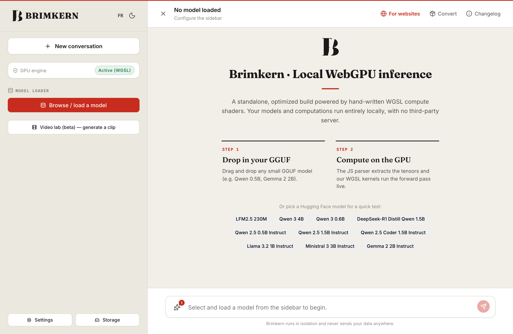

<div align="center">


### Run real AI models **natively in the browser** — no server, no upload, no API key.

Chat with a 4-billion-parameter LLM, describe an image and watch it appear, generate a short video clip — all computed on **your own GPU**, inside a single tab. Nothing leaves your machine.

`WebGPU` · `WGSL kernels` · `.brik format` · `100% local` · `offline-capable` · `embeddable SDK`



</div>

---

## Why this is different

Every other "AI in your browser" wraps a remote API. **Brimkern doesn't.** The model weights are streamed once, cached on-device, and executed by a hand-written WebGPU engine — the transformer, the diffusion U-Net, the tokenizer, all of it runs locally on your GPU.

- **Private by construction.** Your prompts and files never touch a server. Turn off your Wi-Fi mid-conversation — it keeps working.
- **No install, no account.** Open a URL. The first load streams the model; every load after is instant and offline.
- **Real models, real sizes.** Not toy demos — Qwen 3 4B, Gemma, Llama, Mistral, a hybrid LFM2, vision models, image and video generators.
- **One engine, many modalities.** The same WGSL kernel library drives text, vision, image and video.

> Reading AI models straight from the browser is the revolution. `.brik` is the format that makes it practical, and the SDK is how you drop it into your own product.

---

## What it can do

| Modality | What you get | How |
| --- | --- | --- |
| 💬 **Chat** | Multi-turn conversation, reasoning models (`<think>`), French & English | Streamed decode on a resident GPU KV-cache |
| 👁️ **Vision** | Ask questions about an image you attach | Qwen2-VL (ViT + projector), desktop |
| 🎨 **Image** | Text-to-image, in-browser | SD-Turbo / SDXS + TAESD, WebGPU diffusion |
| 🎬 **Video** *(beta)* | Short animated clips from a prompt | AnimateDiff-Lightning on the diffusion stack |
| 🧩 **SDK** *(for teams)* | Embed on-device AI in your own app | A `<script>` + a prompt — see “Embed it — free SDK” below |

The built-in model browser reads your GPU and connection to recommend a model that will actually run — one click to load, or drop in your own GGUF:


---

## The `.brik` format

GGUF is built for native runtimes; the browser needs something it can **stream, cache, and feed to a GPU without a decompression pass**. `.brik` is our answer:

- **Self-describing container** — architecture, tokenizer and config travel *inside* the file.
- **Pre-quantized for the GPU** — weights are stored int8 / int4 / int3 (or a mixed tier), in the exact layout the fused matmul kernels read. No dequantize-on-load, no CPU stall.
- **Range-streamable** — the header loads first (UI appears in seconds), tensors stream on demand, and the browser cache resumes partial downloads for free.
- **Embedded tokenizer** — fully offline after the first load.

A 4B model ships as a single ~2.5 GB `.brik`; the smallest chat model (a hybrid LFM2) is **~149 MB**. Everything is cached on-device — you can see and manage every byte:


---

## The engine

No `onnxruntime`, no `transformers.js` inference — the forward pass is **hand-written WGSL**:

- Fused quantized matmuls (`matmul_t_q4/q8/q3`), resident KV-cache, single-submit decode.
- Per-architecture kernels: RoPE variants, QK-norm, SwiGLU/GEGLU, GroupNorm, causal & temporal attention, short-conv (hybrid models), direct conv2d for diffusion.
- Every kernel ships a **self-validation** pass against a CPU reference at load, with a silent fallback if a GPU miscompiles.

Architecture notes live in [`docs/`](docs/) — [`perf-webgpu.md`](docs/perf-webgpu.md), [`engine-v2-linear-attention.md`](docs/engine-v2-linear-attention.md), and the per-modality feasibility studies.

---

## Supported models

Load a preset in one click, import your own **GGUF** (converted to `.brik` in-browser), or point at a `.brik` URL.

- **Text** — Qwen 3 (4B / 0.6B), Qwen 2.5 (0.5B / 1.5B / Coder), Llama 3.2, Gemma 2, Ministral 3, DeepSeek-R1 Distill, LFM2.5 (hybrid), RWKV-7 (linear attention).
- **Vision** — Qwen2-VL.
- **Image** — SD-Turbo, SDXS.
- **Video** — AnimateDiff-Lightning (SD 1.5 base).

*(Model weights carry their own licenses — check each one before commercial use. The LFM2 weights are under the LFM 1.0 license.)*

### Pre-quantized `.brik` models on Hugging Face

Ready to stream — pre-quantized, self-describing, Range-served. These are the files the app loads by default:

| Repo | What |
| --- | --- |
| [`romainkh14/LFM2.5-230M_BRIK`](https://huggingface.co/romainkh14/LFM2.5-230M_BRIK) | 149 MB hybrid chat model (mobile default) |
| [`romainkh14/Qwen2.5-0.5B-Instruct_BRIK`](https://huggingface.co/romainkh14/Qwen2.5-0.5B-Instruct_BRIK) | small general chat |
| [`romainkh14/Qwen3-4B_BRIK`](https://huggingface.co/romainkh14/Qwen3-4B_BRIK) | the most capable text model (desktop) |
| [`romainkh14/brimkern-image-BRIK`](https://huggingface.co/romainkh14/brimkern-image-BRIK) | SD-Turbo / SDXS image weights |
| [`romainkh14/brimkern-video-BRIK`](https://huggingface.co/romainkh14/brimkern-video-BRIK) | AnimateDiff-Lightning video weights |

Any other GGUF (Qwen, Gemma, Llama, Mistral, DeepSeek…) also loads directly — the app converts it to `.brik` in-browser on first load.

---

## Performance

`.brik` sizes are exact; throughput is **hardware-dependent** — the speeds below are indicative, measured on an Apple-silicon laptop (discrete GPUs are faster, phones slower).

| Model | `.brik` size | Precision | Runs on |
| --- | --- | --- | --- |
| LFM2.5 230M · hybrid | 149 MB | int4 | mobile + desktop |
| Qwen 3 0.6B | 639 MB | int8 | mobile + desktop |
| Qwen 2.5 0.5B | 396 MB | mixed int4/int8 | mobile + desktop |
| Qwen 3 4B | 2.5 GB | int4 | desktop (discrete GPU) |
| SD-Turbo / SDXS · image | 0.4–1.3 GB | int4/int8 | desktop · SDXS-light on mobile |

Measured on that laptop: LFM2.5 230M decodes at **~30 tok/s**; a 4B model returns its first token in **~2 s** once warm; a 256 px image in a few seconds. The model streams once on first load, then it's cached and runs offline.

---

## Quickstart

```bash
git clone <this-repo> brimkern
cd brimkern
npm install
npm run dev          # http://localhost:3000
```

Requirements: a **WebGPU-capable browser** (Chrome/Edge 121+, or Safari 18+). A discrete GPU helps for the larger models; the light presets run on integrated GPUs and mobile.

```bash
npm run build && npm run start   # production
```

---

## Embed it — free SDK

Brimkern isn't only an app; it's an engine you can drop into your own product. Add a small `<script>`, hand it a system prompt, and it runs a model on **your visitor's GPU** — which makes it **free to run at any scale**: no inference bill, no server, private by construction, offline after first load.

```html
<!-- sdk.js is served by the app itself (same-origin) -->
<script src="https://brimkern.romainkhanoyan.fr/sdk.js"></script>
<script>
  Brimkern.embed({
    model: 'lfm2.5-230m',                     // a light .brik, streamed on first engagement
    system: 'You are a friendly support assistant for Acme.',  // behaviour = a prompt, no fine-tuning
  });
</script>
```

- **Free** — the compute is the visitor's GPU: no per-token cost, no rate limits, infinite scale.
- **Private** — prompts and data never leave the browser (strong GDPR / health / legal story).
- **Light on the page** — the SDK is a few KB of JS; the model downloads only when the user engages the widget, so **PageSpeed is untouched**.

A live pitch page ships at `/local-ai`, and a working integration example at `/sdk-demo.html`. *(SDK v0 — chat widget, custom model URL, colors & wording; knowledge documents and tools are next.)*

---

## Privacy

100% local. No telemetry, no server round-trips for inference. Optional web features (a Wikipedia lookup, link reading) are **opt-in** and clearly labelled — the default is zero network after the model is cached.

---

## Project layout

```
src/
  app/                 Next.js App Router — the UI (chat, image, video labs)
  lib/
    webgpu/            the engine: kernels.ts (WGSL), per-arch models, diffusion, video
    brik/              the .brik container: parser, codec (q3/q4/q8), streaming loader
  lib/presets.ts       one-click model catalog
docs/                  architecture + feasibility studies
```

---

## License

Code released under the [MIT License](LICENSE) © 2026 Romain Khanoyan.

Model **weights** are not covered by this license — each carries its own terms (e.g. the LFM2 weights are under the LFM 1.0 license). Check a model's license before commercial use.

---

<div align="center">
<sub>Built with hand-written WebGPU kernels. Made, not generated.</sub>
</div>
