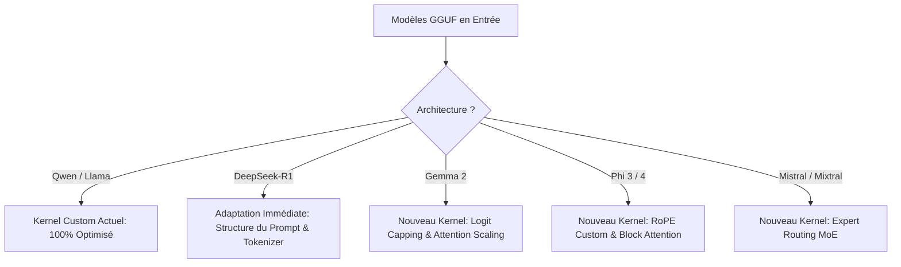

# Plan d'Action : Optimisations WebGPU (WGSL) & Adaptation de Modèles

Ce document présente la stratégie technique pour améliorer les performances de calcul du moteur WebGPU standalone d'AuraLLM et la feuille de route pour adapter de nouvelles architectures de modèles avec nos kernels actuels.

---

## Part 1 : Optimisation des Performances de Calcul WebGPU (WGSL)

Actuellement, les calculs de projection (Q, K, V, output) et de décodage s'exécutent entièrement sur le GPU. Cependant, plusieurs goulots d'étranglement (principalement liés à la bande passante mémoire et à l'accès séquentiel) limitent la vitesse d'inférence (tokens/s).

### 1. Vectorisation des Accès Mémoire (128-bit) — ✅ FAIT (matmul_t)
*   **Problème actuel** : Les shaders WGSL lisent et écrivent des données sous forme de scalaires `f32` individuels. Cela génère des requêtes mémoire 32 bits répétées.
*   **Solution** : Réécrire les buffers d'entrée/sortie et les boucles de calcul pour manipuler des vecteurs `vec4<f32>` (128 bits). 
*   **Impact** : Aligne les accès mémoire avec les bus de données matériels des cartes graphiques modernes (Nvidia, AMD, Apple Silicon), multipliant le débit mémoire par un facteur de 2 à 4.
*   **Statut** : Kernel `matmul_t_vec4` implémenté dans `kernels.ts` — les deux opérandes (`a` et `w`) sont relues comme `array<vec4<f32>>` (chargements 128 bits) le long de l'axe de contraction `k`. `matmulT` bascule dessus automatiquement quand `k % 4 == 0` (toujours vrai pour Qwen/Llama : `d`, `ffn`, `headDim` sont multiples de 4), sinon repli sur le kernel scalaire. C'est l'opération que traverse **tout** matmul d'inférence réelle (`transposed=true`). Une couverture `selfValidate` de `matmulT` a été ajoutée (elle était absente avant — le self-test n'exerçait que `matmul` scalaire), validant chemin vec4 et repli scalaire à chaque chargement de modèle.
*   **Reste à faire** : Vectoriser de même les sorties et les kernels element-wise (`rmsnorm`, `swiglu`, `add`, `addbias`) — gains plus marginaux.

### 2. Tiling & Utilisation de la Mémoire Partagée (`workgroup`) pour le Matmul
*   **Problème actuel** : Notre shader `matmul_t` actuel effectue des lectures directes depuis la mémoire globale du GPU (`storage` buffer) pour chaque itération de la multiplication matricielle.
*   **Solution** : Implémenter un algorithme de *Matmul Tilé*. Charger des blocs (tiles) de la matrice d'activation et de la matrice de poids dans la mémoire partagée locale du groupe de travail (`var<workgroup>`) avant d'effectuer les multiplications-accumulations.
*   **Impact** : Réduit drastiquement la dépendance à la bande passante VRAM globale en exploitant le cache L1 ultra-rapide du GPU.

### 3. Déquantification à la Volée dans le Shader (Dequantize-on-the-Fly)
*   **Problème actuel** : Actuellement, le moteur déquantifie les tenseurs GGUF (ex: Q4_K_M ou Q8_0) dans un tampon `f32` intermédiaire sur le GPU avant de lancer le matmul. Cela consomme de la mémoire temporaire et implique deux passes de shader distinctes.
*   **Solution** : Fusionner la logique de déquantification directement au sein du shader de multiplication matricielle (`matmul_t`). Le shader lira les octets quantifiés (de type `u32` contenant 8 blocs de 4 bits ou 4 blocs de 8 bits) et appliquera le facteur d'échelle (scale) et l'offset à la volée dans les registres du GPU lors du calcul.
*   **Impact** :
    *   Division par 2 à 4 de l'empreinte mémoire d'activation.
    *   Élimination des tampons temporaires f32 sur le GPU.
    *   Amélioration de 50%+ des performances sur les configurations à faible bande passante (PC portables, GPU intégrés).

### 4. Utilisation des Subgroups (WebGPU Subgroups Extension)
*   **Problème actuel** : La synchronisation entre les threads d'un même groupe utilise `workgroupBarrier()`, ce qui force tous les threads à s'attendre au niveau du bloc de calcul.
*   **Solution** : Tirer parti de l'extension `subgroups` de WebGPU (lorsqu'elle est disponible dans le navigateur) pour échanger des données directement entre les threads d'un même warp/wavefront sans passer par la mémoire partagée ou les barrières de synchronisation.
*   **Impact** : Amélioration majeure des performances de réduction pour le calcul de l'attention et des normes (RMSNorm/Softmax).

---

## Part 2 : Modèles à Adapter & Feuille de Route d'Intégration

Notre kernel actuel supporte de façon optimale les architectures de type **Qwen (1.5/2/2.5)** et **Llama (3/3.2)** (avec KV Cache, attention GQA, RoPE classique et RMSNorm). Voici comment adapter les autres modèles populaires :

### 1. DeepSeek-R1 (Modèles Distillés 1.5B & 8B)
*   **Statut actuel** : Partiellement supporté (l'architecture sous-jacente des modèles distillés est basée sur Qwen ou Llama).
*   **Adaptation requise** :
    *   **Tokenizer** : Configurer le tokenizer pour supporter le tag `<think>` et gérer l'affichage progressif de la pensée (pensée masquable ou stylisée différemment dans l'UI).
    *   **Taille du contexte** : Optimiser le KV Cache pour supporter des contextes plus larges (ex: 8k-16k) requis pour le raisonnement logique long.
*   **Priorité** : Haute (très forte demande des utilisateurs).

### 2. Gemma 2 (2B & 9B)
*   **Statut actuel** : Non supporté par nos kernels optimisés (bascule sur les kernels génériques lents).
*   **Adaptation requise** :
    *   **Attention Query Scaling** : Gemma 2 multiplie les clés/valeurs par un facteur d'échelle non standard lors de l'attention. Nous devons adapter notre shader `causal_attention` pour injecter ce facteur d'échelle.
    *   **Logit Capping** : Gemma 2 applique un écrêtage des logits (valeur plafonnée à +/- 30.0 ou +/- 50.0) lors de la multiplication attention-score et de la projection finale. Il faut ajouter une opération de clamp dans le shader WGSL.
    *   **RMSNorm alternée** : Gemma utilise des normalisations supplémentaires après certaines couches.
*   **Priorité** : Moyenne.

### 3. Phi-3 / Phi-4 (Microsoft - 3.8B & 14B)
*   **Statut actuel** : Non supporté.
*   **Adaptation requise** :
    *   **RoPE (Rotary Position Embedding) non-standard** : Phi-3 utilise une fréquence RoPE segmentée et des dimensions de rotation spécifiques. Nous devons écrire une variante du shader `rope` pour supporter ces hyperparamètres.
    *   **Sliding Window Attention (SWA)** : Gérer une fenêtre d'attention glissante dans notre KV cache pour économiser la mémoire et éviter d'accumuler tout le contexte historique.
*   **Priorité** : Moyenne.

### 4. Mistral 7B & Mixtral 8x7B (MoE)
*   **Statut actuel** : Non supporté (Mixtral).
*   **Adaptation requise** :
    *   **Expert Routing (MoE)** : Pour Mixtral, implémenter un shader de routage qui calcule les coefficients de routage pour chaque token, puis distribue dynamiquement les calculs de FFN (Feed-Forward Network) vers les 2 experts sélectionnés (parmi 8) sur le GPU.
    *   **VRAM Management** : Les architectures MoE nécessitent le chargement de nombreux poids (ex: 47 Go pour Mixtral 8x7B). Il est nécessaire de concevoir un système de streaming de couches ou d'exécuter uniquement les modèles MoE distillés compacts (comme DeepSeek-R1-MoE).
*   **Priorité** : Faible (taille des modèles peu adaptée à un usage grand public en navigateur).
